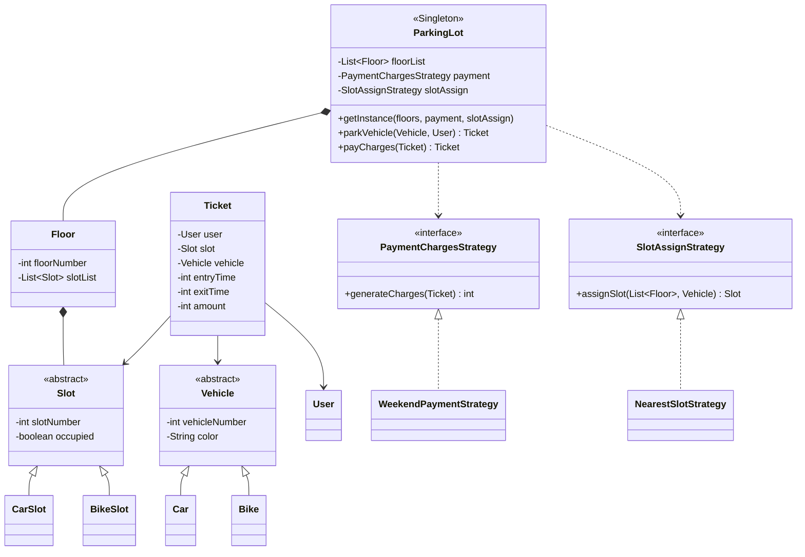
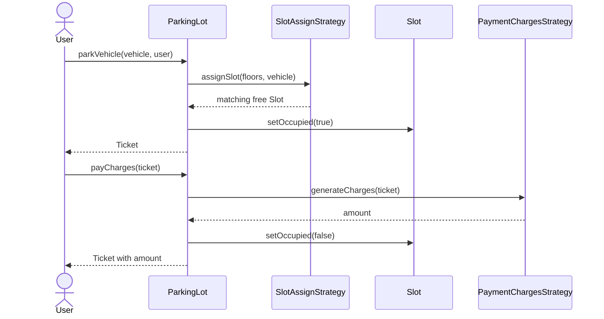

<div align="center">

# 🅿️ Parking Lot — Low Level Design

**Two Strategy axes, so pricing and slot allocation can change without touching the parking lot.**

The classic system-design interview problem — floors, slots, vehicles, tickets — modelled so that
"charge differently at weekends" and "allocate slots differently" are each a new class, not an edit.


[Problem](#-the-problem) · [Design](#-the-design) · [Structure](#-structure) · [Run it](#-run-it)

</div>

---

## 📋 The problem

> Design a parking lot.
>
> - The system handles vehicles parking
> - Every vehicle enters, gets a ticket, and pays on exit
> - The ticket carries floor and slot information
> - A parking lot has floors; a floor has slots
> - Slots have types matching vehicle types — car, two-wheeler, and so on

**Future scope:** slot categories such as VIP or accessible parking.

## 💡 The design

Two things about a parking lot change constantly, and they change independently:

1. **How much you charge** — flat rate, hourly, weekend surcharge, first-hour-free, EV discount.
2. **Which slot you hand out** — nearest to the entrance, nearest to the lift, cheapest, random.

Both are pulled out behind interfaces and injected at construction. `ParkingLot` never asks *what
kind* of pricing or allocation it has:

```java
ParkingLot lot = ParkingLot.getInstance(
    3,
    new WeekendPaymentStrategy(),   // swap for HourlyPaymentStrategy, FlatRateStrategy…
    new NearestSlotStrategy()       // swap for NearestToLiftStrategy, CheapestSlotStrategy…
);
```

Adding weekday pricing is a new class implementing `PaymentChargesStrategy`. Nothing in
`ParkingLot`, `Floor`, `Ticket` or `Slot` changes. That's the Open/Closed Principle paying rent.

The **vehicle and slot hierarchies are parallel and abstract** — `Vehicle → Car | Bike`,
`Slot → CarSlot | BikeSlot` — so adding trucks means two new subclasses plus the allocation rule,
with no change to the classes that hold them.

## 🏗 Structure



## 🔄 Park and exit flow



`parkVehicle` and the lot's mutation points are `synchronized` — two cars arriving at once must not
be handed the same slot.

## 🎯 Patterns used

| Pattern | Where | Why |
|---|---|---|
| **Strategy** | `PaymentChargesStrategy`, `SlotAssignStrategy` | The two policies most likely to change, isolated behind interfaces |
| **Singleton** | `ParkingLot.getInstance()` | One physical lot, one object — double-checked with a `synchronized` block |
| **Abstract base classes** | `Vehicle`, `Slot` | New vehicle types extend rather than modify |

## ▶️ Run it

```bash
git clone https://github.com/prakashshuklahub/Parking-Lot-LLD.git
cd Parking-Lot-LLD
javac -d out $(find src -name '*.java')
java -cp out org.example.ParkingLotApplication
```

The demo builds a 3-floor lot, parks a red car, and charges for it via the weekend strategy.

## 🔭 Known limitations

Honest list — this is a design exercise, and these are the next things to fix:

- **`WeekendPaymentStrategy` hardcodes duration.** It computes `hours` from the ticket, then overwrites it with `hours = 20` before multiplying. The strategy seam is right; the arithmetic inside it is placeholder.
- **Entry and exit times are stubbed** to `10` and `20` in `parkVehicle`, so no real duration is ever measured.
- **`NearestSlotStrategy` only searches floor 0.** It reads `floors.get(0)` and never looks further, so a full ground floor means `null` rather than a slot upstairs.
- **Slot numbers collide across floors.** `Floor` numbers slots as `floorNumber + i`, so floor 1 and floor 2 produce overlapping numbers. They should be unique, or scoped by floor.
- **`Ticket` never records its floor**, and its constructor takes a `Vehicle` it doesn't assign — the caller sets it afterwards.
- **No `unpark` / exit flow** that frees the slot independently of payment.

---

<div align="center">

Part of a low-level design series by **[Prakash Shukla](https://github.com/prakashshuklahub)**

[The Hustling Engineer](https://www.youtube.com/@TheHustlingEngineer) · [LinkedIn](https://www.linkedin.com/in/prakash-shukla/)

</div>
